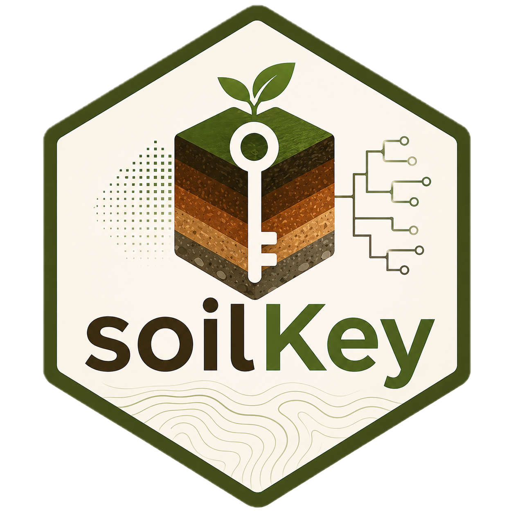
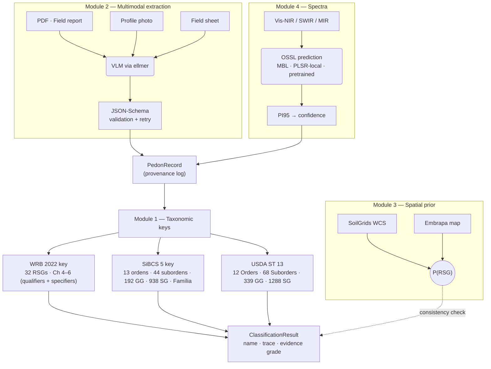

<!-- README.md -->

# soilKey 

[](https://lifecycle.r-lib.org/articles/stages.html)


> **Automated soil profile classification under WRB 2022 (4th ed.), USDA Soil Taxonomy (13th ed.), and the Brazilian SiBCS (5ª edição).** All three systems wired end-to-end down to the deepest categorical level. Multimodal extraction, spatial priors, OSSL spectroscopy and explicit per-attribute provenance — without ever delegating the taxonomic key to a language model.

<!-- Status & coverage badges -->
[](LICENSE.md)
[](https://CRAN.R-project.org/package=soilKey)
[](https://zenodo.org/)
[](https://github.com/HugoMachadoRodrigues/soilKey/actions)
[](tests/)
[](https://app.codecov.io/)
[](#-coverage)
[](#-coverage)
[](#-coverage)
<br/>
<!-- Author / social badges -->
[](https://x.com/Hugo_MRodrigues)
[](https://orcid.org/0000-0002-8070-8126)
[](https://www.researchgate.net/profile/Hugo-Rodrigues-12)

---

## ✦ The headline result

A canonical Brazilian *Latossolo Vermelho Distrocoeso* on Mata Atlântica gneiss, classified end-to-end across the **three canonical systems down to the deepest level**:

```r
library(soilKey)

pedon <- make_ferralsol_canonical()

# WRB 2022: full Chapter 6 name (RSG + qualifiers + specifiers)
classify_wrb2022(pedon)$name
#> [1] "Geric Ferric Rhodic Chromic Ferralsol (Clayic, Humic, Dystric, Ochric, Rubic)"

# SiBCS 5a ed.: 4o nivel (Subgrupo) + Familia (5o nivel)
classify_sibcs(pedon, include_familia = TRUE)$name
#> [1] "Latossolos Vermelhos Distroficos tipicos, argilosa, moderado"

# USDA Soil Taxonomy 13ed: Order -> Suborder -> Great Group -> Subgroup
classify_usda(pedon)$name
#> [1] "Rhodic Hapludox"
```

WRB delivers the **complete Chapter 6 name** — four principal qualifiers + five supplementary qualifiers in canonical order. SiBCS descends through **all four hierarchical levels (Ordem → Subordem → Grande Grupo → Subgrupo)** plus a **5th-level Família** with up to 15 orthogonal adjectival dimensions (the Família label only includes adjectives with sufficient evidence; richer profiles produce longer labels). USDA Soil Taxonomy walks the **complete Path C** (Order → Suborder → Great Group → Subgroup) per *Keys to Soil Taxonomy 13th ed.* All three keys are deterministic R code driven from versioned YAML rules.

---

## ✦ Why soilKey?

There is no public, mantained, end-to-end implementation of any of the three major soil classification systems. WRB acknowledges (in the 4th-edition preface) that internal classification algorithms exist within the IUSS Working Group but have not been released. The U.S. `SoilTaxonomy` package on CRAN provides lookup tables but not the key. There is **zero** public software for SiBCS.

`soilKey` closes that gap with three principles:

1. **The taxonomic key is never delegated to a language model.** LLMs are restricted to schema-validated extraction. Every classification is a deterministic walk through versioned YAML rules with a full decision trace.
2. **Every value carries a provenance tag.** `measured` · `predicted_spectra` · `extracted_vlm` · `inferred_prior` · `user_assumed`. The result's *evidence grade* (A–D) summarises that log so callers always know how robust the classification is.
3. **Side modules never overrule the key.** Spatial priors flag inconsistencies but cannot silently change the assigned RSG; spectral predictions fill missing attributes with explicit confidence; multimodal extraction pulls structured data without writing class names.

---

## ✦ Architecture



**Module 1 (the key) and Module 4 (spectra) are independent.** A profile with no spectra still classifies; a profile with full lab data still benefits from the spatial-prior consistency check.

---

## ✦ Coverage

`soilKey` faithfully reproduces three canonical books, with versioned YAML rules cross-referencing the page numbers of each diagnostic and qualifier definition.

### WRB 2022 (4th edition, IUSS Working Group)

| Chapter | Component                                | Coverage      |
| :------ | :--------------------------------------- | :------------ |
| Ch 3.1  | Diagnostic horizons                      | **32 / 32**   |
| Ch 3.2  | Diagnostic properties                    | **17 / 17**   |
| Ch 3.3  | Diagnostic materials                     | **19 / 19**   |
| Ch 4    | Reference Soil Groups (RSGs) + tier-2 gates | **32 / 32**  |
| Ch 5    | Principal qualifiers (full lists)        | **all 32 RSGs** |
| Ch 5    | Sub-qualifiers (Hyper- / Hypo- / Proto-) | **11 wired**  |
| Ch 6    | Supplementary qualifiers (parenthesised) | **seed (5 new + ~30 reused)** |
| Ch 6    | Specifiers (Ano- / Epi- / Endo- / Bathy- / Panto- / Kato- / Amphi- / Poly- / Supra- / Thapto-) | **10 / 10** |

Each WRB diagnostic function returns a `DiagnosticResult` with per-sub-test evidence, layer indices, missing-attribute report and the literature reference (e.g. *"IUSS Working Group WRB (2022), Chapter 3.1.20, Salic horizon (p. 49)"*).

### SiBCS 5ª edição (Embrapa, 2018) — **all 5 levels wired**

| Capítulo / Categoria     | Coverage  |
| :----------------------- | :-------- |
| Cap 1 — Atributos diagnósticos | **~50** (carater_alítico, álico, eutrófico, ferri, hidromórfico, retrátil, vértico, …) |
| Cap 2 — Horizontes diagnósticos | **~30** (B textural, B latossólico, B nítico, B espódico, B incipiente, A chernozêmico, A húmico, A proeminente, …) |
| Cap 3 — Sistema (1º nível, Ordens) | **13 / 13** |
| Cap 4 — Subordens (2º nível) | **44 / 44** |
| Caps 5–17 — Grandes Grupos (3º nível) | **192** |
| Caps 5–17 — Subgrupos (4º nível) | **938** |
| Cap 18 — Família (5º nível) | **15 dimensões adjectivais ortogonais** (grupamento textural, subgrupamento textural, distribuição de cascalhos, esquelética, tipo de A, prefixos epi/meso/endo, saturação V, álico, mineralogia da areia, mineralogia da argila, atividade da argila, óxidos de ferro, ândico, material subjacente, espessura > 100 cm, lenhosidade) |
| Cap 18 — Séries (6º nível) | **deferred** (provisório no SiBCS 5ª ed.) |

Each SiBCS YAML rule cross-references the page numbers of *Sistema Brasileiro de Classificação de Solos*, 5ª ed. (Santos et al., 2018).

### USDA Soil Taxonomy (13th edition, Soil Survey Staff 2022) — **Path C complete**

| Component           | Coverage |
| :------------------ | :------- |
| Soil Orders (Ch 4)  | **12 / 12** |
| Suborders (Caps 5–16) | **68** |
| Great Groups        | **339** |
| Subgroups (focused scientific subset) | **1 288** |
| Diagnostic epipedons (Ch 3) | **6** (histic, folistic, melanic, mollic, umbric, ochric; anthropic + plaggen deferred) |
| Diagnostic characteristics (Ch 3) | **5** (aquic conditions, anhydrous conditions, cryoturbation, glacic layer, permafrost) |
| Pure-USDA helpers (per-Order Subgroups) | **~120** (kandic, fragipan, duripan, petroferric contact, anionic, rhodic, xanthic, sombric, vitric, andic, vertic, glossic, ferric, vermic, halic, frasic, paleargid, …) |

Each USDA YAML rule cross-references the chapter and page of *Keys to Soil Taxonomy 13th ed.* (e.g. *"Cap 9 Gelisols (pp 189-198)"*).

### Code-level metrics

| Metric                            | Value |
| :-------------------------------- | :---- |
| Public functions (`NAMESPACE` exports) | **694** |
| R source (lines)                  | **~28 400** |
| YAML rules (keys + diagnostics + qualifiers) | **~16 200 lines** |
| Test files / expectations         | **82 / 2 602** |
| Tests passing                     | **922** (0 failures) |
| Vignettes                         | 6 |
| Canonical fixtures                | 31 (one per WRB RSG, plus auxiliaries) |

---

## ✦ Installation

```r
# install.packages("remotes")
remotes::install_github("HugoMachadoRodrigues/soilKey")
```

Or, from a local clone:

```r
# install.packages("devtools")
devtools::install("path/to/soilKey")
```

`soilKey` requires only base R + `R6`, `data.table`, `yaml`, `cli`, `rlang`. Optional integrations (spectra, spatial, VLM, PDF/photo) are pulled in via `Suggests`.

---

## ✦ Quick start

### 1. Build a `PedonRecord` from horizon data

```r
library(soilKey)

pr <- PedonRecord$new(
  site = list(
    id              = "BR-LV-001",
    lat             = -22.5, lon = -43.7,
    country         = "BR",
    parent_material = "gneiss"
  ),
  horizons = data.frame(
    top_cm    = c(0,    15,   35,   65,   130),
    bottom_cm = c(15,   35,   65,   130,  200),
    designation        = c("A",  "AB", "BA", "Bw1","Bw2"),
    munsell_hue_moist  = rep("2.5YR", 5),
    munsell_value_moist  = c(3, 3, 3, 4, 4),
    munsell_chroma_moist = c(4, 4, 6, 6, 6),
    clay_pct = c(50, 52, 55, 60, 60),
    silt_pct = c(15, 14, 10,  8,  8),
    sand_pct = c(35, 34, 35, 32, 32),
    cec_cmol = c(8, 6.5, 5.5, 5.0, 4.8),
    bs_pct   = c(24, 17, 14, 13, 13),
    al_cmol  = c(0.7, 0.8, 0.6, 0.5, 0.5),
    ph_h2o   = c(4.8, 4.7, 4.7, 4.8, 4.9),
    ph_kcl   = c(4.0, 4.0, 4.0, 4.1, 4.2),
    oc_pct   = c(2.0, 1.2, 0.6, 0.3, 0.2)
  )
)
```

### 2. Classify across three systems in one pass

```r
# WRB 2022 -- full Chapter 6 name
classify_wrb2022(pr)$name
#> [1] "Geric Ferric Rhodic Chromic Ferralsol (Clayic, Humic, Dystric, Ochric, Rubic)"

# SiBCS 5a ed. -- 4o nivel categorico (Subgrupo) + Familia (5o nivel)
classify_sibcs(pr, include_familia = TRUE)$name
#> [1] "Latossolos Vermelhos Distroficos tipicos, argilosa, moderado"

# USDA Soil Taxonomy 13ed -- Subgroup
classify_usda(pr)$name
#> [1] "Rhodic Hapludox"
```

### 3. Inspect the trace and evidence grade

```r
result <- classify_wrb2022(pr)
result$evidence_grade
#> [1] "A"

result$qualifiers$principal
#> [1] "Geric"   "Ferric"  "Rhodic"  "Chromic"

result$qualifiers$supplementary
#> [1] "Clayic"  "Humic"   "Dystric" "Ochric"  "Rubic"

# The key tested 15 RSGs before assigning Ferralsols.
result$trace
```

### 4. Gap-fill missing attributes from spectra

```r
# Vis-NIR spectrum per horizon, OSSL backbone:
pr$spectra$vnir <- my_spectra_matrix

fill_from_spectra(
  pr,
  library    = "ossl",
  region     = "south_america",
  properties = c("clay_pct", "cec_cmol", "bs_pct", "oc_pct"),
  method     = "mbl"
)
# Now classify_wrb2022(pr)$evidence_grade may be "B" (predicted_spectra)
# instead of "A" (measured) — provenance survives.
```

### 5. Cross-check against a spatial prior

```r
prior <- spatial_prior_soilgrids(pr, buffer_m = 250)
prior_consistency_check(rsg_code = result$rsg_or_order, prior = prior)
#> $consistent : TRUE
#> $note       : "Ferralsols at probability 0.62 in the SoilGrids buffer"
```

---

## ✦ Documentation

Six vignettes walk every layer of the package:

| Vignette                                | Topic                                                                  |
| :-------------------------------------- | :--------------------------------------------------------------------- |
| `01-getting-started`                    | Build `PedonRecord` · run diagnostics · key trace                     |
| `02-classify-wrb-end-to-end`            | Full Latossolo with the canonical Ch 6 name + family suppression      |
| `03-cross-system-correlation`           | WRB ↔ SiBCS ↔ USDA on the same profile                                |
| `04-vlm-extraction`                     | Multimodal extraction with `MockVLMProvider` (offline)                |
| `05-spatial-spectra-pipeline`           | SoilGrids prior + OSSL gap-fill                                       |
| `06-wosis-benchmark`                    | Validation protocol; mini-benchmark on 31 fixtures                    |

Browse:

```r
browseVignettes("soilKey")
```

The complete design document is in [`ARCHITECTURE.md`](ARCHITECTURE.md) (40 KB, Portuguese, with the full v0.1 → v1.0 roadmap).

---

## ✦ Provenance & evidence grade

Every value used by the key is recorded in `pedon$provenance` with:

- `attribute`  : column name
- `source`     : `measured` / `predicted_spectra` / `extracted_vlm` / `inferred_prior` / `user_assumed`
- `confidence` : `[0, 1]` (NA for `measured`)
- `notes`      : free-form (often the source quote)

The `ClassificationResult$evidence_grade` is the worst-source rule applied to the *attributes that were actually decisive in the classification* — so a Ferralsol classified entirely from lab data yields **A**; the same profile with one critical clay value predicted from spectra yields **B**.

```r
pr$add_measurement(4, "clay_pct", 60,
                   source = "predicted_spectra", confidence = 0.85)
classify_wrb2022(pr)$evidence_grade
#> [1] "B"
```

This is **the** distinguishing feature of `soilKey` versus a hypothetical LLM-driven classifier. Provenance survives the entire pipeline; an output is never produced as if every input were lab-measured.

---

## ✦ Citing

If `soilKey` contributes to your work, please cite:

```bibtex
@software{rodrigues_soilkey_2026,
  author  = {Rodrigues Machado, Hugo},
  title   = {{soilKey}: Automated soil profile classification per
             {WRB} 2022, {SiBCS} 5, and {USDA} {Soil Taxonomy} 13},
  year    = {2026},
  version = {0.9.8},
  doi     = {pending},
  url     = {https://github.com/HugoMachadoRodrigues/soilKey}
}
```

A peer-reviewed methodology paper is in preparation (target: *SoftwareX*, *Geoderma*, *Computers & Geosciences*, or *European Journal of Soil Science*).

---

## ✦ References

The canonical books `soilKey` implements:

- **WRB**: IUSS Working Group WRB (2022). *World Reference Base for Soil Resources, 4th edition.* International Union of Soil Sciences, Vienna, Austria. [FAO PDF](https://www.fao.org/3/i3794en/I3794en.pdf)
- **USDA**: Soil Survey Staff (2022). *Keys to Soil Taxonomy, 13th edition.* USDA-NRCS. [USDA-NRCS PDF](https://www.nrcs.usda.gov/sites/default/files/2022-09/Keys-to-Soil-Taxonomy.pdf)
- **SiBCS**: Santos, H.G., Jacomine, P.K.T., Anjos, L.H.C. dos, Oliveira, V.A. de, Lumbreras, J.F., Coelho, M.R., Almeida, J.A. de, Araújo Filho, J.C. de, Oliveira, J.B. de & Cunha, T.J.F. (2018). *Sistema Brasileiro de Classificação de Solos*, 5ª ed. revista e ampliada. Embrapa, Brasília. [Embrapa PDF](https://www.embrapa.br/solos/sibcs)

External integrations:

- **OSSL**: Sanderman, J., Savage, K., Dangal, S.R.S., Duran, G., Rivard, C., Cardona, M.T., Sandzhieva, A., Aramian, A. & Safanelli, J.L. (2024). *Soil Spectroscopy for Global Good — the Open Soil Spectral Library (OSSL).* [soilspectroscopy.org](https://soilspectroscopy.org/)
- **SoilGrids**: Poggio, L., de Sousa, L.M., Batjes, N.H., Heuvelink, G.B.M., Kempen, B., Ribeiro, E. & Rossiter, D. (2021). *SoilGrids 2.0: producing soil information for the globe with quantified spatial uncertainty.* SOIL 7, 217–240. [DOI](https://doi.org/10.5194/soil-7-217-2021)
- **WoSIS**: Batjes, N.H., Calisto, L. & de Sousa, L.M. (2024). *Providing quality-assessed and standardised soil data to support global mapping and modelling (WoSIS snapshot 2023).* Earth System Science Data 16, 4735–4765. [DOI](https://doi.org/10.5194/essd-16-4735-2024)
- **aqp**: Beaudette, D.E., Roudier, P. & O'Geen, A.T. (2013). *Algorithms for quantitative pedology: A toolkit for soil scientists.* Computers & Geosciences 52, 258–268. [DOI](https://doi.org/10.1016/j.cageo.2012.10.020)
- **SoilTaxonomy** (R): Beaudette, D.E., Skaggs, T.H. & O'Geen, A.T. *SoilTaxonomy: a system of soil classification for making and interpreting soil surveys.* CRAN package. [CRAN](https://CRAN.R-project.org/package=SoilTaxonomy)

---

## ✦ Acknowledgements

Architecture, taxonomy interpretation, and per-RSG canonical fixtures: Hugo Rodrigues Machado (Universidade Federal Rural do Rio de Janeiro, UFRRJ — Departamento de Solos).

Builds on `aqp` (Beaudette et al., USDA-NRCS) for pedological data structures, `SoilTaxonomy` (Beaudette et al.) for USDA lookup tables, the **Open Soil Spectral Library** consortium for the spectral backbone, and **ISRIC** for SoilGrids and WoSIS.

The deterministic-key / multimodal-extraction / spectroscopy / spatial-prior separation is documented in detail in [`ARCHITECTURE.md`](ARCHITECTURE.md), and the per-release scope is tracked in commit history (and in `NEWS.md` from v1.0 onwards).

---

## ✦ License

**MIT** © 2026 Hugo Rodrigues. CRAN-style template at [`LICENSE`](LICENSE); full text at [`LICENSE.md`](LICENSE.md).

<details>
<summary>Full MIT License text</summary>

```
MIT License

Copyright (c) 2026 Hugo Rodrigues

Permission is hereby granted, free of charge, to any person obtaining a copy
of this software and associated documentation files (the "Software"), to deal
in the Software without restriction, including without limitation the rights
to use, copy, modify, merge, publish, distribute, sublicense, and/or sell
copies of the Software, and to permit persons to whom the Software is
furnished to do so, subject to the following conditions:

The above copyright notice and this permission notice shall be included in all
copies or substantial portions of the Software.

THE SOFTWARE IS PROVIDED "AS IS", WITHOUT WARRANTY OF ANY KIND, EXPRESS OR
IMPLIED, INCLUDING BUT NOT LIMITED TO THE WARRANTIES OF MERCHANTABILITY,
FITNESS FOR A PARTICULAR PURPOSE AND NONINFRINGEMENT. IN NO EVENT SHALL THE
AUTHORS OR COPYRIGHT HOLDERS BE LIABLE FOR ANY CLAIM, DAMAGES OR OTHER
LIABILITY, WHETHER IN AN ACTION OF CONTRACT, TORT OR OTHERWISE, ARISING FROM,
OUT OF OR IN CONNECTION WITH THE SOFTWARE OR THE USE OR OTHER DEALINGS IN THE
SOFTWARE.
```

</details>

---

## ✦ Notes for life

> _Education without ethics is only rhetoric._

> _Power without reflection is violence._

---

<p align="center">
  Made with ❤️ by <a href="https://orcid.org/0000-0002-8070-8126"><strong>Hugo Rodrigues</strong></a> for Soil Science
</p>

<p align="center">
  <a href="https://x.com/Hugo_MRodrigues"></a>
  &nbsp;
  <a href="https://orcid.org/0000-0002-8070-8126"></a>
  &nbsp;
  <a href="https://www.researchgate.net/profile/Hugo-Rodrigues-12"></a>
</p>

---

<sub>**Status**: pre-CRAN, v0.9.8. **All three classification systems are wired end-to-end down to the deepest categorical level** — WRB 2022 (32 RSGs + qualifiers + specifiers), SiBCS 5ª ed. (Ordem → Subordem → Grande Grupo → Subgrupo → Família, ~1 200 classes), and USDA Soil Taxonomy 13ed (Order → Suborder → Great Group → Subgroup, ~1 700 classes). v1.0 will close the WoSIS benchmark run, the methodology paper, and the CRAN submission. Track the roadmap in [`ARCHITECTURE.md` §12](ARCHITECTURE.md#12-roadmap-de-implementação).</sub>
