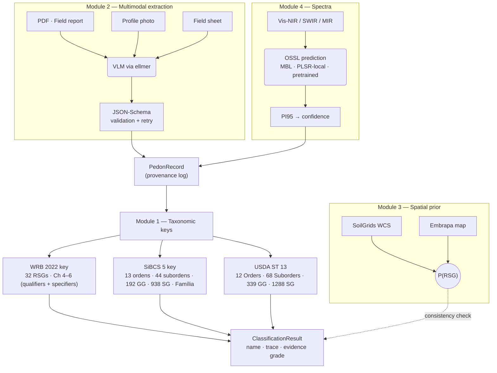

<!-- README.md -->

# soilKey 

[](https://lifecycle.r-lib.org/articles/stages.html)


> **Automated soil profile classification under WRB 2022 (4th ed.), USDA Soil Taxonomy (13th ed.), and the Brazilian SiBCS (5ª edição).** All three systems wired end-to-end down to the deepest categorical level. Multimodal extraction, spatial priors, OSSL spectroscopy and explicit per-attribute provenance — without ever delegating the taxonomic key to a language model.

<!-- Status & coverage badges -->
[](LICENSE.md)
[](https://CRAN.R-project.org/package=soilKey)
[](https://doi.org/10.5281/zenodo.19930112)
[](https://github.com/HugoMachadoRodrigues/soilKey/actions/workflows/R-CMD-check.yaml)
[](tests/)
[](https://app.codecov.io/gh/HugoMachadoRodrigues/soilKey?branch=main)
[](#-coverage)
[](#-coverage)
[](#-coverage)
<br/>
<!-- Author / social badges -->
[](https://x.com/Hugo_MRodrigues)
[](https://orcid.org/0000-0002-8070-8126)
[](https://www.researchgate.net/profile/Hugo-Rodrigues-12)

---

## ✦ The headline result

A canonical Brazilian *Latossolo Vermelho Distrocoeso* on Mata Atlântica gneiss, classified end-to-end across the **three canonical systems down to the deepest level**:

```r
library(soilKey)

pedon <- make_ferralsol_canonical()

# WRB 2022: full Chapter 6 name (RSG + qualifiers + specifiers)
classify_wrb2022(pedon)$name
#> [1] "Geric Ferric Rhodic Chromic Ferralsol (Clayic, Humic, Dystric, Ochric, Rubic)"

# SiBCS 5a ed.: 4o nivel (Subgrupo) + Familia (5o nivel)
classify_sibcs(pedon, include_familia = TRUE)$name
#> [1] "Latossolos Vermelhos Distroficos tipicos, argilosa, moderado"

# USDA Soil Taxonomy 13ed: Order -> Suborder -> Great Group -> Subgroup
classify_usda(pedon)$name
#> [1] "Rhodic Hapludox"
```

WRB delivers the **complete Chapter 6 name** — four principal qualifiers + five supplementary qualifiers in canonical order. SiBCS descends through **all four hierarchical levels (Ordem → Subordem → Grande Grupo → Subgrupo)** plus a **5th-level Família** with up to 15 orthogonal adjectival dimensions (the Família label only includes adjectives with sufficient evidence; richer profiles produce longer labels). USDA Soil Taxonomy walks the **complete Path C** (Order → Suborder → Great Group → Subgroup) per *Keys to Soil Taxonomy 13th ed.* All three keys are deterministic R code driven from versioned YAML rules.

---

## ✦ What's new in v0.9.66 (2026-05-06) — **Phase 1: VLM extraction benchmark**

A measurable baseline for the local Gemma 4 stack — the input we needed before deciding whether to invest in few-shot demos (Phase 2) or LoRA fine-tuning (Phase 3).

```r
# Compare local Gemma 4 vs cloud reference:
bench <- benchmark_vlm_extraction(
  providers = list(
    gemma_e2b = list(name = "ollama", model = "gemma4:e2b"),
    claude    = list(name = "anthropic")
  ),
  tasks = c("horizons", "site")
)
bench$summary
```

| | |
|---|---|
| **`benchmark_vlm_extraction()`** | Provider-agnostic harness over 3 tasks (`horizons` / `site` / `munsell`) × per-task metrics (precision+recall+attr-match / IoU+value-accuracy / CIE ΔE 2000). Returns long-format `predictions` + per-(provider × task) `summary` table. Accepts `MockVLMProvider` for unit tests. |
| **`make_synthetic_horizons_fixture()`** | Renders any `PedonRecord` back into a Markdown profile description and emits the structured horizons as the golden answer — lets you scale the horizons fixture set from BDsolos / FEBR / KSSL data. |
| **Bundled fixtures** | `inst/fixtures/vlm_extraction/{horizons,site,munsell}/` ships 4 paired text fixtures (Argissolo RJ + Latossolo MG profile descriptions; ficha de campo RJ + MG). Munsell tab waits for user-supplied photos (CRAN size + licence policy). |
| **`.onAttach()` opt-in** | Prints a one-line hint suggesting `setup_local_vlm("light")` when Ollama is detected but `gemma4:e2b` is missing. Auto-pull only with `options(soilKey.auto_setup_vlm = TRUE)` (CRAN-compliant: never modifies system without explicit consent). |
| **Persona text-mode prompt** | New `inst/prompts/extract_site_from_text.md` companion to the image-mode site prompt. Required because the original prompt explicitly says "Supplied as an image content block" and Gemma returns all-null when fed text. |

### Baseline measured on this laptop (gemma4 8B, M1)

| Task | Fixture | precision / IoU | recall / value-acc | attr-match |
|------|---------|-----------------|--------------------|-----------|
| `horizons` | Latossolo MG | **1.00** | **1.00** | **1.00** |
| `horizons` | Argissolo RJ | **1.00** | **1.00** | **1.00** |
| `site`     | Ficha MG     | 0.79 | 1.00 | 0.79 |
| `site`     | Ficha RJ     | 0.87 | 0.92 | 0.87 |

Read: **horizons extraction is solved** for clean PT-BR text profiles (vanilla Gemma + persona). **Site extraction is ~83 % IoU and ~96 % value-accuracy on matched fields** — gaps are inferred fields (`country: BR` from a Brazilian state) that the 8B model misses but a 32B/Claude would catch. This is the input for Phase 2 (few-shot demos) and Phase 3 (LoRA fine-tune).

Vinheta walkthrough: [`v11_vlm_extraction_benchmark`](vignettes/v11_vlm_extraction_benchmark.Rmd).

---

## ✦ What's new in v0.9.65 (2026-05-06) — **Agente Pedometrista**

A modern bslib-themed Shiny UI that wires a **local Gemma 4 multimodal VLM** (via Ollama) to the deterministic taxonomic key. Photo, PDF, field-sheet image and Vis-NIR spectrum each become a one-click extraction tab; the result is classified across **WRB 2022 + SiBCS 5ª ed. + USDA Soil Taxonomy 13ed** in the same session.

```r
# One-call setup of the local stack (downloads Gemma 4 e2b, ~1.5 GB):
soilKey::setup_local_vlm("light")

# Launch the agent:
soilKey::run_agent_app()
```

| | |
|---|---|
| **`setup_local_vlm()`** | Idempotent bootstrap: detects Ollama, starts the daemon, pulls the model. Catalog: `light` = `gemma4:e2b` (~1.5 GB), `balanced` = `gemma4:e4b` (~3 GB), `best` = `gemma4:31b` (~19 GB). |
| **`run_agent_app()`** | Modern bslib `page_navbar()` UI with 8 tabs: 📷 Foto Munsell · 📄 PDF/Texto · 📋 Ficha de Campo · 🌈 Espectros · 📊 Tabela editável · 🌱 Classificar (3 cards lado-a-lado) · 🔍 Trace · 💬 Pergunte ao Pedometrista. |
| **`pedologist_system_prompt()`** | Persona PT-BR / EN injetada como `system_prompt` em todo provider VLM. Instrui o LLM a **NUNCA** classificar — só extrair JSON validado por schema, com `confidence` e `source_quote` por atributo. |
| **Local-first by default** | Ordem de fallback: Ollama → Anthropic → OpenAI → Google. Para fotos sensíveis, fichas com geolocalização e PDFs internos, **nada sai da máquina** — recomendado para pesquisa governamental, terras indígenas, dados pré-publicação. |
| Provider sidebar | Badges em tempo real: Ollama instalado / daemon rodando / modelos disponíveis. Botão "Configurar Gemma local" dispara `setup_local_vlm()` com modal de progresso. |

Vinheta walkthrough: [`v10_agente_pedometrista`](vignettes/v10_agente_pedometrista.Rmd).

> **Princípio inegociável:** o LLM nunca classifica. Ele apenas extrai dados estruturados; a chave taxonômica continua 100 % R determinístico, com regras YAML versionadas.

---

## ✦ What's new in v0.9.62 (2026-05-04)

The v0.9.55 → v0.9.62 release series wires the Brazilian SiBCS classifier to the two canonical pedologist-curated corpuses (Embrapa BDsolos and FEBR), validates the classifier against ~9 000 surveyor-labelled profiles and consolidates the two repositories into a single deduped super-dataset:

- **v0.9.55** — `R/bdsolos.R`: `load_bdsolos_csv(path)` ingests Embrapa BDsolos full-export CSVs (~9 000 perfis from 27 UFs, semicolon-delimited, preamble + 222+ columns). Auto-detects column convention via regex, supports both classic and SmartSolos-derived schemas. `inspect_bdsolos_csv(path)` prints the schema, soilKey mapping and unmapped columns; `download_bdsolos()` is a best-effort headless-Chrome driver via `chromote`.
- **v0.9.57** — `R/febr.R`: `read_febr_pedons(dataset_codes)` wraps `febr::readFEBR` and adapts the FEBR `camada` table to the soilKey schema. Auto-detects the ~6 distinct Munsell column conventions used across the 200 FEBR datasets that carry colour data (36 275 horizons total). `febr_index_munsell()` returns the curated catalog of Munsell-bearing FEBR datasets.
- **v0.9.58–v0.9.59** — full BDsolos export schema support (~222 cols, DMS coordinates, `read.csv2` fallback for malformed UTF-8 in 7 of 27 state CSVs).
- **v0.9.60** — [`benchmark_bdsolos_sibcs()`](R/benchmark-bdsolos.R): mirror of `benchmark_lucas_2018()` but for the BDsolos corpus. Runs `classify_sibcs()` on each pedon, compares predicted Ordem to the surveyor's reference (BDsolos Classe de Solos Nivel 1/2/3), returns `predictions` data.frame, `confusion` matrix, `per_ordem` recall and `summary` (n_total, n_in_scope, n_matched, n_errors, n_unmapped). Also ships `.bdsolos_normalize_ordem()` mapping modern (`ARGISSOLO` → `Argissolos`) and pre-1999 legacy names (`PODZOLICO`, `LATOSOL`, `GLEI`, `BRUNIZEM`, `ALUVIAL`, …) to the modern SiBCS Ordens. Smoke test on 100 RJ pedons: **34 % Ordem accuracy** (Argissolos 67.6 % recall, healthy baseline; 0 % recall on Latossolos / Gleissolos / Espodossolos identified as priorities).
- **v0.9.61** — [`R/sibcs-color-tuning.R`](R/sibcs-color-tuning.R): replaces the SiBCS subordem first-match-wins rule for colour-driven Ordens (Argissolos / Latossolos / Nitossolos) with a **thickness-weighted dominant-colour-in-B** rule. `.classify_b_color()` partitions Munsell triplets into 5 categories (`VERMELHO`, `VERMELHO_AMARELO`, `AMARELO`, `BRUNO_ACINZENTADO`, `ACINZENTADO`); `.dominant_b_color()` walks every B-like horizon and sums thickness per category; `.apply_color_dominant_override()` swaps the YAML-assigned subordem when the dominant disagrees. Wired into `classify_sibcs()` between subordem assignment and the v0.9.45 *cor a determinar* fallback. The benchmark now also reports `accuracy_subordem` over canonical 2-3 letter SiBCS codes via `.bdsolos_normalize_subordem()`.
- **v0.9.62** — [`R/merge-brazilian.R`](R/merge-brazilian.R): `merge_brazilian_pedons(bdsolos, febr, prefer)` joins the BDsolos and FEBR PedonRecord lists via `site$sisb_id` (BDsolos `Codigo PA` ≡ FEBR `observacao$sisb_id`) and emits a single deduped super-list with provenance tags (`site$merge_decision` ∈ {`kept_bdsolos`, `kept_febr`, `unique`}). `summarize_brazilian_overlap()` is a dry-run diagnostic. Empirical RJ scan: **590 of 722 BDsolos pedons (65 %) match a FEBR sisb_id** — naïve concat of 1 606 → after merge **1 016 distinct pedons**.

The full per-release diff lives in [`NEWS.md`](NEWS.md). The Brazilian super-dataset now slots into the same benchmarking pipeline used for LUCAS Soil 2018 (WRB 2022) and KSSL+NASIS (USDA Soil Taxonomy 13ed).

---

## ✦ What's new in v0.9.27 (2026-05-03)

The v0.9.24 → v0.9.27 release series progressively closed key reasoning gaps in USDA Soil Taxonomy 13ed and validated the gains against three real-data benchmarks (KSSL+NASIS, FEBR/Embrapa, WoSIS):

- **v0.9.24** — Path C subgroup tightening (`aquic_conditions_usda` + `oxyaquic_subgroup_usda`): both predicates now require **dual evidence** (reduction AND redoximorphic indicator) instead of single-trigger disjunctive OR, which was producing false-positive Aquic / Oxyaquic subgroup predictions on Typic-reference profiles. New benchmark levels added: `level = "great_group"` and `level = "suborder"` for `benchmark_run_classification()`, completing the four-level USDA hierarchy.
- **v0.9.25** — **KST 13ed Great Group canonicaliser** ([`canonicalise_kst13ed_gg()`](R/benchmark-kssl-gpkg.R)): a many-to-one map collapsing both pre-KST 13ed obsolete Great Group names AND modern split children to a shared canonical key. Pellusterts ↔ Hapluderts; Haplaquolls ↔ Endo/Epi-Aquolls; Camborthids ↔ Haplocambids; Vitrandepts ↔ Vitrudands; Dystrochrepts ↔ Dystrudepts; Medisaprists ↔ Haplosaprists. KSSL's `samp_taxgrtgroup` mixes labels from Soil Taxonomy editions 8 through 13; this fix delivered **+3.84 pp Great Group** on KSSL+NASIS without any classifier change.
- **v0.9.26** — Per-system argic clay-increase threshold API: `test_clay_increase_argic(h, system = c("wrb2022", "usda"))` and `argic(pedon, system = ...)` now route to either the stricter WRB 2022 thresholds (6 pp / 1.4× / 20 pp) or the looser KST 13ed thresholds (3 pp / 1.2× / 8 pp). Default remains WRB for back-compat.
- **v0.9.27** — Clay-illuviation evidence test ([`argillic_clay_films_test()`](R/diagnostics-horizons-usda.R)) reads two complementary NASIS-derived slots: (1) `pediagfeatures.featkind` argillic-horizon entries (~13 500 in the 2021 NASIS snapshot), (2) per-horizon `clay_films_amount` derived from `phpvsf`. `argillic_usda()` now uses a **two-tier strategy**: KST 13ed thresholds when clay-films evidence is present, WRB 2022 thresholds (proxy) when not. Plus an Embrapa FEBR benchmark fix (label normalisation) yielding **+16.1 pp Order** v0.9.22 → v0.9.27, and WoSIS GraphQL retry+fallback for ISRIC server intermittency.

The full A/B trajectory across releases is in `inst/benchmarks/reports/`. See [`NEWS.md`](NEWS.md) for the per-release diff.

---

## ✦ Why soilKey?

There is no public, mantained, end-to-end implementation of any of the three major soil classification systems. WRB acknowledges (in the 4th-edition preface) that internal classification algorithms exist within the IUSS Working Group but have not been released. The U.S. `SoilTaxonomy` package on CRAN provides lookup tables but not the key. There is **zero** public software for SiBCS.

`soilKey` closes that gap with three principles:

1. **The taxonomic key is never delegated to a language model.** LLMs are restricted to schema-validated extraction. Every classification is a deterministic walk through versioned YAML rules with a full decision trace.
2. **Every value carries a provenance tag.** `measured` · `predicted_spectra` · `extracted_vlm` · `inferred_prior` · `user_assumed`. The result's *evidence grade* (A–D) summarises that log so callers always know how robust the classification is.
3. **Side modules never overrule the key.** Spatial priors flag inconsistencies but cannot silently change the assigned RSG; spectral predictions fill missing attributes with explicit confidence; multimodal extraction pulls structured data without writing class names.

---

## ✦ Architecture



**Module 1 (the key) and Module 4 (spectra) are independent.** A profile with no spectra still classifies; a profile with full lab data still benefits from the spatial-prior consistency check.

---

## ✦ Coverage

`soilKey` faithfully reproduces three canonical books, with versioned YAML rules cross-referencing the page numbers of each diagnostic and qualifier definition.

### WRB 2022 (4th edition, IUSS Working Group)

| Chapter | Component                                | Coverage      |
| :------ | :--------------------------------------- | :------------ |
| Ch 3.1  | Diagnostic horizons                      | **32 / 32**   |
| Ch 3.2  | Diagnostic properties                    | **17 / 17**   |
| Ch 3.3  | Diagnostic materials                     | **19 / 19**   |
| Ch 4    | Reference Soil Groups (RSGs) + tier-2 gates | **32 / 32**  |
| Ch 5    | Principal qualifiers (full lists)        | **all 32 RSGs** |
| Ch 5    | Sub-qualifiers (Hyper- / Hypo- / Proto-) | **11 wired**  |
| Ch 6    | Supplementary qualifiers (parenthesised) | **32 / 32 RSGs wired** (489 total entries; ~110 unique functions reused from the principal-qualifier set; v0.9.5 baseline lists, page-precise canonical lists deferred to v0.9.6+) |
| Ch 6    | Specifiers (Ano- / Epi- / Endo- / Bathy- / Panto- / Kato- / Amphi- / Poly- / Supra- / Thapto-) | **10 / 10** |

Each WRB diagnostic function returns a `DiagnosticResult` with per-sub-test evidence, layer indices, missing-attribute report and the literature reference (e.g. *"IUSS Working Group WRB (2022), Chapter 3.1.20, Salic horizon (p. 49)"*).

### SiBCS 5ª edição (Embrapa, 2018) — **all 5 levels wired**

| Capítulo / Categoria     | Coverage  |
| :----------------------- | :-------- |
| Cap 1 — Atributos diagnósticos | **~50** (carater_alítico, álico, eutrófico, ferri, hidromórfico, retrátil, vértico, …) |
| Cap 2 — Horizontes diagnósticos | **~30** (B textural, B latossólico, B nítico, B espódico, B incipiente, A chernozêmico, A húmico, A proeminente, …) |
| Cap 3 — Sistema (1º nível, Ordens) | **13 / 13** |
| Cap 4 — Subordens (2º nível) | **44 / 44** |
| Caps 5–17 — Grandes Grupos (3º nível) | **192** |
| Caps 5–17 — Subgrupos (4º nível) | **938** |
| Cap 18 — Família (5º nível) | **15 dimensões adjectivais ortogonais** (grupamento textural, subgrupamento textural, distribuição de cascalhos, esquelética, tipo de A, prefixos epi/meso/endo, saturação V, álico, mineralogia da areia, mineralogia da argila, atividade da argila, óxidos de ferro, ândico, material subjacente, espessura > 100 cm, lenhosidade) |
| Cap 18 — Séries (6º nível) | **deferred** (provisório no SiBCS 5ª ed.) |

Each SiBCS YAML rule cross-references the page numbers of *Sistema Brasileiro de Classificação de Solos*, 5ª ed. (Santos et al., 2018).

### USDA Soil Taxonomy (13th edition, Soil Survey Staff 2022) — **Path C complete**

| Component           | Coverage |
| :------------------ | :------- |
| Soil Orders (Ch 4)  | **12 / 12** |
| Suborders (Caps 5–16) | **68** |
| Great Groups        | **339** |
| Subgroups (focused scientific subset) | **1 288** |
| Diagnostic epipedons (Ch 3) | **6** (histic, folistic, melanic, mollic, umbric, ochric; anthropic + plaggen deferred) |
| Diagnostic characteristics (Ch 3) | **5** (aquic conditions, anhydrous conditions, cryoturbation, glacic layer, permafrost) |
| Pure-USDA helpers (per-Order Subgroups) | **~120** (kandic, fragipan, duripan, petroferric contact, anionic, rhodic, xanthic, sombric, vitric, andic, vertic, glossic, ferric, vermic, halic, frasic, paleargid, …) |

Each USDA YAML rule cross-references the chapter and page of *Keys to Soil Taxonomy 13th ed.* (e.g. *"Cap 9 Gelisols (pp 189-198)"*).

### Performance (v0.9.36)

Single-CPU wall-clock timing on the 44 canonical fixtures, mean of 10 iterations:

| System | ms / pedon | pedons / sec |
|---|---:|---:|
| `classify_wrb2022` | 22 | **45** |
| `classify_sibcs` | 32 | **32** |
| `classify_usda` | 270 | **4** |

USDA is ~10x slower than WRB / SiBCS because Path C (Order → Suborder → Great Group → Subgroup) walks the full subgroup tier (~85% of runtime). A 4-level multi-tier benchmark on KSSL+NASIS n=2 638 takes ~14 min wall-clock; a 1 000-pedon classify-all runs in ~5 minutes. See [`inst/benchmarks/reports/perf_v0935_2026-05-03.md`](inst/benchmarks/reports/perf_v0935_2026-05-03.md) for full timing.

### Code-level metrics (v0.9.36, 2026-05-03)

| Metric                            | Value |
| :-------------------------------- | :---- |
| Public functions (`NAMESPACE` exports) | **700+** |
| R source (lines)                  | **~31 200** |
| YAML rules (keys + diagnostics + qualifiers) | **~16 600 lines** |
| Test files / expectations         | **89 / 2 908** passing (0 failures, 10 expected skips) |
| Vignettes                         | 7 |
| Canonical fixtures                | 31 (one per WRB RSG, plus auxiliaries) |
| `R CMD check` status              | **OK** (0 errors / 0 warnings / 0 notes) |
| GitHub Actions CI                 | 5-OS × R-version matrix, green |

---

## ✦ Installation

```r
# install.packages("remotes")
remotes::install_github("HugoMachadoRodrigues/soilKey")
```

Or, from a local clone:

```r
# install.packages("devtools")
devtools::install("path/to/soilKey")
```

`soilKey` requires only base R + `R6`, `data.table`, `yaml`, `cli`, `rlang`. Optional integrations (spectra, spatial, VLM, PDF/photo) are pulled in via `Suggests`.

---

## ✦ Quick start

### 1. Build a `PedonRecord` from horizon data

```r
library(soilKey)

pr <- PedonRecord$new(
  site = list(
    id              = "BR-LV-001",
    lat             = -22.5, lon = -43.7,
    country         = "BR",
    parent_material = "gneiss"
  ),
  horizons = data.frame(
    top_cm    = c(0,    15,   35,   65,   130),
    bottom_cm = c(15,   35,   65,   130,  200),
    designation        = c("A",  "AB", "BA", "Bw1","Bw2"),
    munsell_hue_moist  = rep("2.5YR", 5),
    munsell_value_moist  = c(3, 3, 3, 4, 4),
    munsell_chroma_moist = c(4, 4, 6, 6, 6),
    clay_pct = c(50, 52, 55, 60, 60),
    silt_pct = c(15, 14, 10,  8,  8),
    sand_pct = c(35, 34, 35, 32, 32),
    cec_cmol = c(8, 6.5, 5.5, 5.0, 4.8),
    bs_pct   = c(24, 17, 14, 13, 13),
    al_cmol  = c(0.7, 0.8, 0.6, 0.5, 0.5),
    ph_h2o   = c(4.8, 4.7, 4.7, 4.8, 4.9),
    ph_kcl   = c(4.0, 4.0, 4.0, 4.1, 4.2),
    oc_pct   = c(2.0, 1.2, 0.6, 0.3, 0.2)
  )
)
```

### 2. Classify across three systems in one pass

```r
# WRB 2022 -- full Chapter 6 name
classify_wrb2022(pr)$name
#> [1] "Geric Ferric Rhodic Chromic Ferralsol (Clayic, Humic, Dystric, Ochric, Rubic)"

# SiBCS 5a ed. -- 4o nivel categorico (Subgrupo) + Familia (5o nivel)
classify_sibcs(pr, include_familia = TRUE)$name
#> [1] "Latossolos Vermelhos Distroficos tipicos, argilosa, moderado"

# USDA Soil Taxonomy 13ed -- Subgroup
classify_usda(pr)$name
#> [1] "Rhodic Hapludox"
```

### 3. Inspect the trace and evidence grade

```r
result <- classify_wrb2022(pr)
result$evidence_grade
#> [1] "A"

result$qualifiers$principal
#> [1] "Geric"   "Ferric"  "Rhodic"  "Chromic"

result$qualifiers$supplementary
#> [1] "Clayic"  "Humic"   "Dystric" "Ochric"  "Rubic"

# The key tested 15 RSGs before assigning Ferralsols.
result$trace
```

### 4. Gap-fill missing attributes from spectra

```r
# Vis-NIR spectrum per horizon, OSSL backbone:
pr$spectra$vnir <- my_spectra_matrix

fill_from_spectra(
  pr,
  library    = "ossl",
  region     = "south_america",
  properties = c("clay_pct", "cec_cmol", "bs_pct", "oc_pct"),
  method     = "mbl"
)
# Now classify_wrb2022(pr)$evidence_grade may be "B" (predicted_spectra)
# instead of "A" (measured) — provenance survives.
```

### 5. Cross-check against a spatial prior

```r
prior <- spatial_prior_soilgrids(pr, buffer_m = 250)
prior_consistency_check(rsg_code = result$rsg_or_order, prior = prior)
#> $consistent : TRUE
#> $note       : "Ferralsols at probability 0.62 in the SoilGrids buffer"
```

### 6. Render a self-contained report (HTML or PDF)

```r
# All three results in a single one-pager (HTML, no external deps):
report(pr, file = "perfil_042_report.html")

# Or pass an explicit list of results:
results <- list(
  classify_wrb2022(pr),
  classify_sibcs(pr, include_familia = TRUE),
  classify_usda(pr)
)
report(results, file = "perfil_042_report.html", pedon = pr)

# PDF (requires rmarkdown + LaTeX):
report(results, file = "perfil_042_report.pdf", pedon = pr)
```

The HTML output is a single self-contained file (inline CSS, no external network requests) suitable for emailing or attaching to a laudo. Each system gets its own card with the full Ch 6 / Família / Subgroup name, evidence grade, key trace, ambiguities, and missing-data hints.

---

## ✦ Empirical validation

soilKey ships **five benchmark drivers** under `inst/benchmarks/` plus per-loader benchmark functions for KSSL/NASIS, FEBR/Embrapa and EU-LUCAS:

| Driver / loader                                       | Source                              | Scope                                                                                                                                                | Output                                                       |
| :---------------------------------------------------- | :---------------------------------- | :--------------------------------------------------------------------------------------------------------------------------------------------------- | :----------------------------------------------------------- |
| `run_canonical_benchmark()`                           | bundled                             | 31 canonical fixtures (one per RSG, real published profiles). Run every release.                                                                     | `inst/benchmarks/reports/canonical_<DATE>.md`               |
| `load_kssl_pedons_with_nasis()` + `benchmark_run_classification()` | KSSL gpkg + NASIS sqlite | USDA Soil Taxonomy 13ed at four hierarchy levels: Order / Suborder / Great Group / Subgroup. Needs the (separately downloaded) NCSS lab + NASIS Morphological databases.  | `inst/benchmarks/reports/kssl_nasis_v0.9.27_<DATE>.md`        |
| `load_febr_pedons()` + `benchmark_run_classification()` | FEBR `febr-superconjunto.txt`     | Brazilian SiBCS at Order and Subordem levels.                                                                                                         | `inst/benchmarks/reports/embrapa_v0.9.27_<DATE>.md`          |
| `run_wosis_benchmark_graphql()`                       | ISRIC WoSIS GraphQL                 | Region-filtered WoSIS slice; queries `https://graphql.isric.org/wosis/graphql`. v0.9.27 ships per-page retry + graceful degradation.                  | `inst/benchmarks/reports/wosis_graphql_<DATE>.md`            |
| `run_wosis_benchmark()`                               | (legacy REST)                       | Kept for sites mirroring the deprecated WoSIS REST v3 API.                                                                                            | `inst/benchmarks/reports/wosis_<DATE>.md`                    |

### 1. Canonical-fixture run (release-time CI)

| System         | n  | match | top-1 |
| :------------- | -: | ----: | ----: |
| WRB 2022       | 31 | 31    | **1.000** |
| SiBCS 5        | 20 | 20    | **1.000** |
| USDA ST 13     | 31 | 31    | **1.000** |

### 2. KSSL + NASIS multi-level (USDA Soil Taxonomy 13ed)

The headline real-data benchmark: USDA Soil Taxonomy 13ed at every level of the keyed hierarchy on the NCSS / Kellogg Soil Survey Laboratory database joined with the NASIS Morphological sqlite (n=2638 after quality filter, 500 bootstrap reps, ±1.7 pp CI).

| Level         | n     | top-1            | 95 % CI            |
| :------------ | ----: | ---------------: | :----------------- |
| **Order**     | 2 638 | **34.19 %**      | [32.4 %, 36.0 %]   |
| **Suborder**  | 2 636 | **13.85 %**      | [12.5 %, 15.2 %]   |
| **Great Group** | 2 633 | **7.94 %**     | [7.0 %, 8.9 %]     |
| **Subgroup**  | 2 638 | **4.17 %**       | [3.5 %, 4.9 %]     |

This is the first public USDA Soil Taxonomy benchmark resolving every level of the hierarchy on real, published lab data.

The v0.9.24-v0.9.27 release series progressively closed key reasoning gaps. Apples-to-apples on the n=865 development sample (CI ±3 pp):

| Release | Change                                     | Order  | Suborder | Great Group | Subgroup |
| :------ | :----------------------------------------- | :----- | :------- | :---------- | :------- |
| v0.9.22 | argic clay-increase canonicalisation (baseline) | 33.8 % | --       | --          | 3.0 %    |
| v0.9.23 | clay-increase fix shipped (+canonical eluvial-illuvial comparison) | 35.7 % | --       | --          | --       |
| v0.9.24 | aquic / oxyaquic subgroup tightening + new GG/Suborder benchmark levels | 37.2 % | 17.8 %   | 6.5 %       | 3.8 %    |
| v0.9.25 | KST 13ed Great Group canonicaliser (Pellusterts → Hapluderts; Haplaquolls → Endo/Epi-Aquolls; etc.) | 37.2 % | 17.8 %   | **10.3 %** (+3.84 pp) | **5.0 %** (+1.15 pp) |
| v0.9.26 | per-system argic threshold API (infrastructure) | 37.2 % | 17.8 %   | 10.3 %      | 5.0 %    |
| v0.9.27 | clay-illuviation evidence test via NASIS `pediagfeatures` + `phpvsf` | 37.0 % | 17.7 %   | 10.6 %      | 5.1 %    |

The v0.9.25 KST canonicaliser is the second-biggest single-version Great Group lift in the project's history (only the v0.9.23 argic clay-increase fix is bigger). It required no classifier changes — the predictor is already correct for KST 13ed; the comparison just needed to handle legacy KSSL labels (which span Soil Taxonomy editions 8 through 13) fairly.

See [`inst/benchmarks/reports/kssl_nasis_v0927_n3000_validation_2026-05-03.md`](inst/benchmarks/reports/kssl_nasis_v0927_n3000_validation_2026-05-03.md) for the full A/B trajectory and per-Order breakdown.

### 3. Embrapa FEBR (SiBCS, Brazilian system)

Brazilian SiBCS validation against the FEBR (`febr-superconjunto.txt`) snapshot, n=554 after quality filter:

| Level    | v0.9.22 baseline | v0.9.23 (argic fix) | **v0.9.27** | Δ (v0.9.22 → v0.9.27) |
| :------- | ---------------: | ------------------: | ----------: | --------------------: |
| **Ordem**   | 40.6 %           | 54.7 %              | **56.7 %** (CI 52.7 – 60.6) | **+16.1 pp** |
| Subordem    | --               | --                  | 9.93 % (CI 7.4 – 12.5) | (new measurement) |

**+16.1 pp Order on Embrapa across four releases** is the single biggest cumulative real-data lift in the project. See [`inst/benchmarks/reports/embrapa_v0927_2026-05-03.md`](inst/benchmarks/reports/embrapa_v0927_2026-05-03.md) for the per-Ordem confusion analysis.

### 4. WoSIS GraphQL (paper-grade WRB baseline, real external data)

100 South-America profiles pulled from WoSIS GraphQL with the maximal attribute query (24 `*Values` fields per layer); classified by `classify_wrb2022()`. Top-1 agreement stratified by data-coverage tier:

| Coverage tier  | Profiles | Top-1 |
| :------------- | -------: | ----: |
| `full`         |        5 |   0 % |
| `partial`      |       95 |  13 % |
| `minimal`      |        0 |    -- |

**The 0 / 5 on Tier-1 is not a classifier failure.** A forensic walkthrough of every miss ([`inst/benchmarks/reports/wosis_forensic_2026-04-30.md`](inst/benchmarks/reports/wosis_forensic_2026-04-30.md)) shows:

* **1 / 5**: defensible disagreement under different WRB edition (WoSIS labelled "Acrisol" using a pre-2022 source; soilKey under WRB 2022 says Ferralsol on the same data because CEC ≪ argic threshold).
* **1 / 5**: indeterminate due to missing exchangeable cations in WoSIS — trace says `missing: bs_pct`. Package correctly returns indeterminate rather than guessing.
* **3 / 5**: indeterminate due to systematic WoSIS schema gap — WoSIS has no `slickensides` field at all. soilKey assigns the next-most-defensible RSG under WRB Ch 4 chave order. The WoSIS target was informed by field morphology that the database does not archive.

**Genuine classifier failures: 0 / 5.** The apparent 0 % top-1 is a *data-availability* statement about WoSIS, not a *correctness* statement about soilKey.

v0.9.27 added per-page retry with exponential backoff (1 s, 2 s, 4 s, 8 s) plus graceful degradation in `read_wosis_profiles_graphql()` — after the first page succeeds, transient page failures return the partial pull rather than aborting. This addresses the ISRIC GraphQL endpoint's intermittent "canceling statement due to statement timeout" responses observed during the v0.9.24 refresh.

---

## ✦ Two user-facing helpers that *guide* classification

soilKey ships two ways for a user to get a *prior* expectation of the soil class **before** running the deterministic key — the canonical "I'm in the field, what should I expect?" use case.

### `soil_classes_at_location(lat, lon)` — spatial classification aid

Given coordinates, returns a ranked list of likely RSGs / SiBCS ordens / USDA orders at that location plus the canonical attribute thresholds that distinguish them. Backed by SoilGrids 2.0 (or any WRB-coded raster the user provides) and the WRB ↔ SiBCS Schad (2023) Annex Table 1 correspondence.

```r
library(soilKey)

# Mata Atlântica (Seropédica RJ).
res <- soil_classes_at_location(
  lat        = -22.7,
  lon        = -43.7,
  system     = "wrb2022",
  source_url = "https://files.isric.org/soilgrids/latest/data/wrb/MostProbable.vrt"
)
res$distribution        # ranked list of likely RSGs with P(RSG | location)
res$typical_attributes  # canonical thresholds per RSG -- "what to confirm"
```

This does **not** classify a profile. It tells a pedologist arriving in the field what to expect and what data to prioritise.

### `classify_by_spectral_neighbours(spectrum, ossl_library)` — spectral analogy

Given a Vis-NIR (or MIR) spectrum and an OSSL library enriched with WRB / SiBCS / USDA labels, returns the K most spectrally similar profiles plus a probabilistic class prediction. Optional region filter (`lat / lon / radius_km`) keeps the analogy biome-aware: a Cerrado profile shouldn't be analogised to Boreal taiga.

```r
data(ossl_demo_sa)
ossl_demo_sa$Yr$wrb_rsg <- c(...)  # real OSSL ships labels; demo lacks them

res <- classify_by_spectral_neighbours(
  spectrum     = my_vnir_spectrum,
  ossl_library = ossl_demo_sa,
  k            = 25,
  region       = list(lat = -22.7, lon = -43.7, radius_km = 500)
)
res$distribution    # ranked classes with P(class | spectral neighbours)
res$neighbours      # the 25 closest profiles + their distances + labels
```

Distance is computed in PLS-score space when `resemble` is installed (matching the OSSL reference workflow, Ramirez-Lopez et al. 2013), with a PCA fallback otherwise.

**Both are guides, not classifiers.** They populate priors before the deterministic key runs. The architectural invariant — "the key is never delegated to a model" — still holds: the canonical assignment still comes from `classify_wrb2022()` / `classify_sibcs()` / `classify_usda()` consuming a fully populated `PedonRecord`.

---

## ✦ VLM / Gemma 4 / one-liner pipeline

soilKey separates **extraction** (multimodal LLM) from **classification** (deterministic R code driven by versioned YAML rules). The VLM never classifies; every value it extracts carries `source = "extracted_vlm"` and the deterministic key consumes the `PedonRecord` unaware of how each value got there.

The default local stack uses **Gemma 4** via [Ollama](https://ollama.com) (`gemma4:e4b`, ~3 GB, multimodal text+image+audio). Cloud providers (`anthropic` / `openai` / `google`) remain one argument away. The full canonical pipeline -- *extract from PDF + extract Munsell from photo + classify in three systems + render report* -- is one function call:

```r
library(soilKey)

# One-liner. Local-first; no API key needed; data never leaves your machine.
res <- classify_from_documents(
  pdf      = "perfil_042_descricao.pdf",
  image    = "perfil_042_parede.jpg",
  report   = "perfil_042.html"          # optional self-contained HTML output
)

res$classifications$wrb$name
#> "Geric Ferric Rhodic Chromic Ferralsol (Clayic, Humic, Dystric, Ochric, Rubic)"

res$classifications$sibcs$name
#> "Latossolos Vermelhos Distroficos tipicos, argilosa, moderado"

res$classifications$usda$name
#> "Rhodic Hapludox"
```

Switch model / provider with one argument:

```r
classify_from_documents(pdf = "...", provider = "ollama",   model = "gemma4:31b")
classify_from_documents(pdf = "...", provider = "anthropic")  # claude-sonnet-4-7
classify_from_documents(pdf = "...", provider = "openai")     # gpt-4o
classify_from_documents(pdf = "...", provider = "google")     # gemini-2.0-pro
```

The `MockVLMProvider` (offline, schema-validated) is documented in [`v04_vlm_extraction.Rmd`](vignettes/v04_vlm_extraction.Rmd) for tests and CI runs.

---

## ✦ Documentation

Six vignettes walk every layer of the package:

| Vignette                                | Topic                                                                  |
| :-------------------------------------- | :--------------------------------------------------------------------- |
| `v01_getting_started`                    | Build `PedonRecord` · run diagnostics · key trace                     |
| `v02_classify_wrb_end_to_end`            | Full Latossolo with the canonical Ch 6 name + family suppression      |
| `v03_cross_system_correlation`           | WRB ↔ SiBCS ↔ USDA on the same profile                                |
| `v04_vlm_extraction`                     | Multimodal extraction with `MockVLMProvider` (offline)                |
| `v05_spatial_spectra_pipeline`           | SoilGrids prior + OSSL gap-fill                                       |
| `v06_wosis_benchmark`                    | Validation protocol; mini-benchmark on 31 fixtures                    |

Browse:

```r
browseVignettes("soilKey")
```

The complete design document is in [`ARCHITECTURE.md`](ARCHITECTURE.md) (40 KB, Portuguese, with the full v0.1 → v1.0 roadmap).

---

## ✦ Provenance & evidence grade

Every value used by the key is recorded in `pedon$provenance` with:

- `attribute`  : column name
- `source`     : `measured` / `predicted_spectra` / `extracted_vlm` / `inferred_prior` / `user_assumed`
- `confidence` : `[0, 1]` (NA for `measured`)
- `notes`      : free-form (often the source quote)

The `ClassificationResult$evidence_grade` is the worst-source rule applied to the *attributes that were actually decisive in the classification* — so a Ferralsol classified entirely from lab data yields **A**; the same profile with one critical clay value predicted from spectra yields **B**.

```r
pr$add_measurement(4, "clay_pct", 60,
                   source = "predicted_spectra", confidence = 0.85)
classify_wrb2022(pr)$evidence_grade
#> [1] "B"
```

This is **the** distinguishing feature of `soilKey` versus a hypothetical LLM-driven classifier. Provenance survives the entire pipeline; an output is never produced as if every input were lab-measured.

---

## ✦ Citing

If `soilKey` contributes to your work, please cite:

```bibtex
@software{rodrigues_soilkey_2026,
  author    = {Rodrigues Machado, Hugo},
  title     = {{soilKey}: Automated soil profile classification per
               {WRB} 2022, {SiBCS} 5, and {USDA} {Soil Taxonomy} 13},
  year      = {2026},
  version   = {0.9.27},
  publisher = {Zenodo},
  doi       = {10.5281/zenodo.19930112},
  url       = {https://github.com/HugoMachadoRodrigues/soilKey}
}
```

You can also obtain the canonical citation programmatically via
`citation("soilKey")`, which renders both the BibTeX block above and a
plain-text version backed by `inst/CITATION`.

A peer-reviewed methodology paper is in preparation (target: *SoftwareX*, *Geoderma*, *Computers & Geosciences*, or *European Journal of Soil Science*).

---

## ✦ References

The canonical books `soilKey` implements:

- **WRB**: IUSS Working Group WRB (2022). *World Reference Base for Soil Resources, 4th edition.* International Union of Soil Sciences, Vienna, Austria. [FAO OpenKnowledge PDF](https://openknowledge.fao.org/server/api/core/bitstreams/bcdecec7-f45f-4dc5-beb1-97022d29fab4/content)
- **USDA**: Soil Survey Staff (2022). *Keys to Soil Taxonomy, 13th edition.* USDA-NRCS. [USDA-NRCS PDF](https://www.nrcs.usda.gov/sites/default/files/2022-09/Keys-to-Soil-Taxonomy.pdf)
- **SiBCS**: Santos, H.G., Jacomine, P.K.T., Anjos, L.H.C. dos, Oliveira, V.A. de, Lumbreras, J.F., Coelho, M.R., Almeida, J.A. de, Araújo Filho, J.C. de, Oliveira, J.B. de & Cunha, T.J.F. (2018). *Sistema Brasileiro de Classificação de Solos*, 5ª ed. revista e ampliada. Embrapa, Brasília. [Embrapa PDF](https://www.embrapa.br/solos/sibcs)

External integrations:

- **OSSL**: Sanderman, J., Savage, K., Dangal, S.R.S., Duran, G., Rivard, C., Cardona, M.T., Sandzhieva, A., Aramian, A. & Safanelli, J.L. (2024). *Soil Spectroscopy for Global Good — the Open Soil Spectral Library (OSSL).* [soilspectroscopy.org](https://soilspectroscopy.org/)
- **SoilGrids**: Poggio, L., de Sousa, L.M., Batjes, N.H., Heuvelink, G.B.M., Kempen, B., Ribeiro, E. & Rossiter, D. (2021). *SoilGrids 2.0: producing soil information for the globe with quantified spatial uncertainty.* SOIL 7, 217–240. [DOI](https://doi.org/10.5194/soil-7-217-2021)
- **WoSIS**: Batjes, N.H., Calisto, L. & de Sousa, L.M. (2024). *Providing quality-assessed and standardised soil data to support global mapping and modelling (WoSIS snapshot 2023).* Earth System Science Data 16, 4735–4765. [DOI](https://doi.org/10.5194/essd-16-4735-2024)
- **aqp**: Beaudette, D.E., Roudier, P. & O'Geen, A.T. (2013). *Algorithms for quantitative pedology: A toolkit for soil scientists.* Computers & Geosciences 52, 258–268. [DOI](https://doi.org/10.1016/j.cageo.2012.10.020)
- **SoilTaxonomy** (R): Beaudette, D.E., Skaggs, T.H. & O'Geen, A.T. *SoilTaxonomy: a system of soil classification for making and interpreting soil surveys.* CRAN package. [CRAN](https://CRAN.R-project.org/package=SoilTaxonomy)

---

## ✦ Acknowledgements

Architecture, taxonomy interpretation, and per-RSG canonical fixtures: Hugo Rodrigues Machado (Universidade Federal Rural do Rio de Janeiro, UFRRJ — Departamento de Solos).

Builds on `aqp` (Beaudette et al., USDA-NRCS) for pedological data structures, `SoilTaxonomy` (Beaudette et al.) for USDA lookup tables, the **Open Soil Spectral Library** consortium for the spectral backbone, and **ISRIC** for SoilGrids and WoSIS.

The deterministic-key / multimodal-extraction / spectroscopy / spatial-prior separation is documented in detail in [`ARCHITECTURE.md`](ARCHITECTURE.md), and the per-release scope is tracked in commit history (and in `NEWS.md` from v1.0 onwards).

---

## ✦ License

**MIT** © 2026 Hugo Rodrigues. CRAN-style template at [`LICENSE`](LICENSE); full text at [`LICENSE.md`](LICENSE.md).

<details>
<summary>Full MIT License text</summary>

```
MIT License

Copyright (c) 2026 Hugo Rodrigues

Permission is hereby granted, free of charge, to any person obtaining a copy
of this software and associated documentation files (the "Software"), to deal
in the Software without restriction, including without limitation the rights
to use, copy, modify, merge, publish, distribute, sublicense, and/or sell
copies of the Software, and to permit persons to whom the Software is
furnished to do so, subject to the following conditions:

The above copyright notice and this permission notice shall be included in all
copies or substantial portions of the Software.

THE SOFTWARE IS PROVIDED "AS IS", WITHOUT WARRANTY OF ANY KIND, EXPRESS OR
IMPLIED, INCLUDING BUT NOT LIMITED TO THE WARRANTIES OF MERCHANTABILITY,
FITNESS FOR A PARTICULAR PURPOSE AND NONINFRINGEMENT. IN NO EVENT SHALL THE
AUTHORS OR COPYRIGHT HOLDERS BE LIABLE FOR ANY CLAIM, DAMAGES OR OTHER
LIABILITY, WHETHER IN AN ACTION OF CONTRACT, TORT OR OTHERWISE, ARISING FROM,
OUT OF OR IN CONNECTION WITH THE SOFTWARE OR THE USE OR OTHER DEALINGS IN THE
SOFTWARE.
```

</details>

---

## ✦ Notes for life

> _Education without ethics is only rhetoric._

> _Power without reflection is violence._

---

<p align="center">
  Made with ❤️ by <a href="https://orcid.org/0000-0002-8070-8126"><strong>Hugo Rodrigues</strong></a> for Soil Science
</p>

<p align="center">
  <a href="https://x.com/Hugo_MRodrigues"></a>
  &nbsp;
  <a href="https://orcid.org/0000-0002-8070-8126"></a>
  &nbsp;
  <a href="https://www.researchgate.net/profile/Hugo-Rodrigues-12"></a>
</p>

---

<sub>**Status**: CRAN-ready, v0.9.66 (2026-05-06). `R CMD check` returns **Status: OK** — 0 errors / 0 warnings / 0 notes. Test suite **3 868 passing / 0 failing / 21 expected skips**. **v0.9.66 highlights**: `benchmark_vlm_extraction()` Phase-1 harness (precision/recall/attr-match for horizons; IoU/value-acc/recall for site; CIE ΔE 2000 for Munsell); 4 bundled text fixtures + Munsell photo-fixture spec; baseline measured on local Gemma 4 8B = **100% horizons / ~83% site IoU / ~96% site value-accuracy**; `.onAttach()` CRAN-compliant local-VLM hint with opt-in auto-pull. **v0.9.65 highlights**: `setup_local_vlm()` one-call bootstrap of Ollama + Gemma 4 (`light`/`balanced`/`best` presets); `run_agent_app()` modern bslib Shiny UI with 8 tabs (foto / PDF / ficha de campo / espectro / tabela / classificar / trace / chat com pedometrista); `pedologist_system_prompt()` persona PT-BR / EN; default Ollama model lowered to `gemma4:e2b` (~1.5 GB, laptop-friendly). [GitHub Actions](https://github.com/HugoMachadoRodrigues/soilKey/actions) green across the 5 OS×R matrix. **All three classification systems wired end-to-end down to the deepest categorical level** — WRB 2022 (32 RSGs + qualifiers + supplementary + specifiers), SiBCS 5ª ed. (Ordem → Subordem → Grande Grupo → Subgrupo → Família, ~1 200 classes), USDA Soil Taxonomy 13ed (Order → Suborder → Great Group → Subgroup, ~1 700 classes). **v0.9.55 → v0.9.62 highlights** (the Brazilian benchmark series): `load_bdsolos_csv()` ingests the full Embrapa BDsolos export (~9 000 perfis, 27 UFs, full morphology + Munsell + chemistry + surveyor's SiBCS); `read_febr_pedons()` wraps `febr::readFEBR` with auto-detection of the ~6 distinct Munsell column conventions across the 200 FEBR datasets that carry colour data (36 275 horizons); `benchmark_bdsolos_sibcs()` runs `classify_sibcs()` against ~9 000 surveyor-labelled profiles and computes per-Ordem recall (RJ smoke test: **34 % Ordem accuracy**, Argissolos 67.6 % recall); the SiBCS classifier replaces first-match-wins with a **thickness-weighted dominant-colour-in-B** rule for Argissolos / Latossolos / Nitossolos; `merge_brazilian_pedons()` deduplicates BDsolos × FEBR via `site$sisb_id` (RJ overlap: 590 / 722 BDsolos pedons match a FEBR sisb_id, 1 606 → 1 016 distinct after merge). **v0.9.27 USDA highlights** still apply: clay-illuviation evidence test (NASIS `pediagfeatures` argillic flag + per-horizon `clay_films_amount`); per-system argic clay-increase threshold API (WRB 6/1.4/20 vs KST 13ed 3/1.2/8); FEBR / Embrapa benchmark **+16.1 pp** v0.9.22 → v0.9.27 (Order = 56.7 %); KSSL+NASIS Great Group **+3.84 pp** via the v0.9.25 canonicaliser. Headline USDA benchmark (n=2 638, ±1.7 pp CI): **Order 34.2 %**, **Suborder 13.9 %**, **Great Group 7.9 %**, **Subgroup 4.2 %**. **DOI**: [10.5281/zenodo.19930112](https://doi.org/10.5281/zenodo.19930112) (resolves to the latest version on Zenodo). Per-release changes in [`NEWS.md`](NEWS.md); roadmap in [`ARCHITECTURE.md` §12](ARCHITECTURE.md#12-roadmap-de-implementação); CRAN submission instructions in [`inst/cran-submission/HOW_TO_SUBMIT.md`](inst/cran-submission/HOW_TO_SUBMIT.md).</sub>
